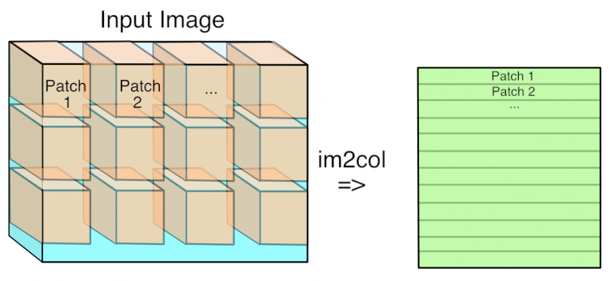

# Im2col SIMD for 2D Tensors

A **SIMD-optimized** implementation of the im2col operation for 2D images (e.g., grayscale). This repository provides C++ source code targeting **AVX2** (x86_64) and **NEON** (Armv8) architectures, as well as a **reference** (non-SIMD) implementation. You can integrate the resulting library into your own C++ project or access it from Python through a simple Ctypes wrapper.



## Overview
The **im2col** (“image to column”) operation is commonly used in convolutional neural networks (CNNs) to transform a 2D image (or feature map) into a set of column vectors, facilitating efficient matrix-multiplication-based convolutions.

By taking advantage of **SIMD intrinsics**, we can significantly speed up the im2col computation on CPUs that support vector operations. This repository includes:
- **AVX2** implementation for modern x86_64 processors  
- **NEON** implementation for Armv8 processors  
- **Reference** scalar implementation (no intrinsics) for portability or as a fallback

The repository also contains a Python wrapper and a Jupyter Notebook that can be used as an example on how to use the library in Python.

## Installation

1. **Clone** this repository:
   ```bash
   git clone https://github.com/Henvezz95/im2col_2D.git
   cd im2col_2D
   ```

2. Configure and build with CMake:
   ```bash
    mkdir build && cd build
    cmake -DCMAKE_BUILD_TYPE=Release ..
    cmake --build .
   ```
   CMake will detect your CPU architecture and automatically compile the corresponding SIMD implementation (AVX2, NEON, or reference).

3. After building, you should find a shared library (e.g., libim2col.so on Linux or im2col.dll on Windows) in your build folder.

## Folder Structure
   ```graphql
    im2col_2D/
    ├── CMakeLists.txt        # Main CMake build script
    ├── src/
    │   ├── im2col_AVX2.cpp   # AVX2 implementation
    │   ├── im2col_NEON.cpp   # NEON implementation
    │   └── im2col_ref.cpp    # Reference (fallback) implementation
    ├── python/
    │   └── im2col.py         # Python ctypes wrapper
    ├── Test Notebook.ipynb   # Jupyter Notebook example
   ```
